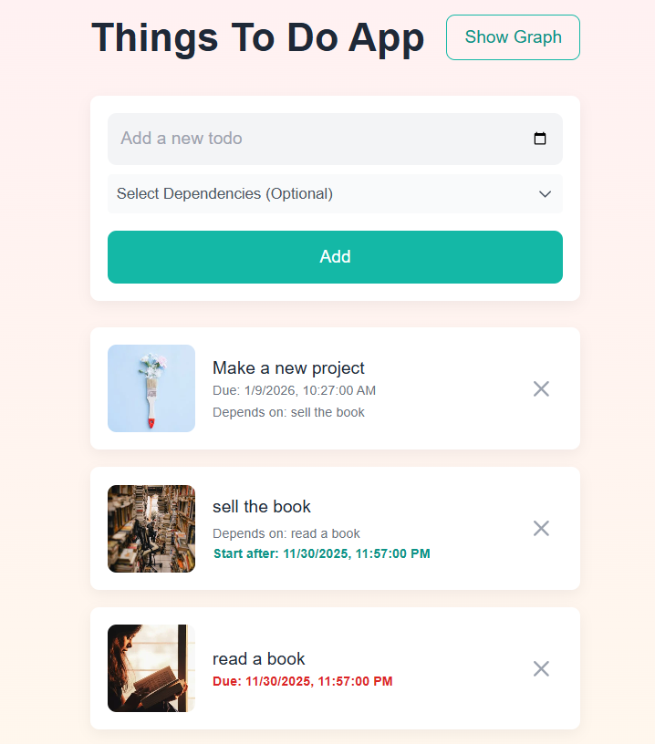
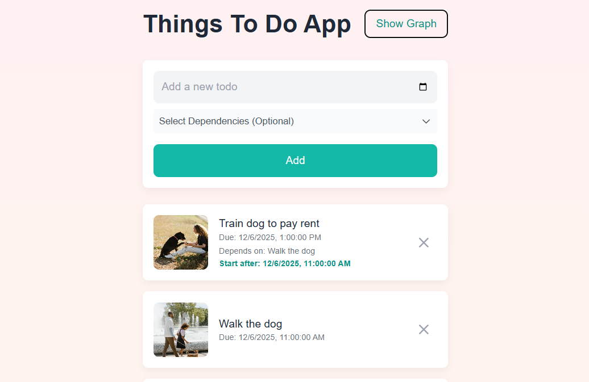
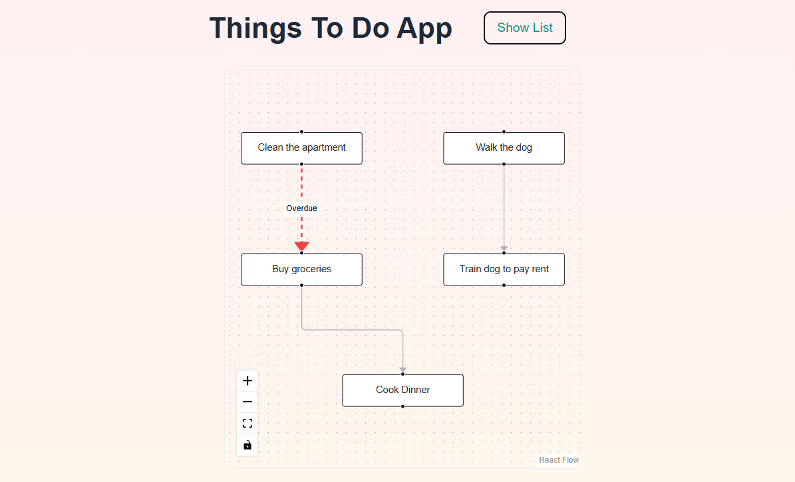

## Soma Capital Technical Assessment

This is a technical assessment as part of the interview process for Soma Capital.

> [!IMPORTANT]  
> You will need a Pexels API key to complete the technical assessment portion of the application. You can sign up for a free API key at https://www.pexels.com/api/  

To begin, clone this repository to your local machine.

## Development

This is a [NextJS](https://nextjs.org) app, with a SQLite based backend, intended to be run with the LTS version of Node.

To run the development server:

```bash
npm i
npm run dev
```

## Task:

Modify the code to add support for due dates, image previews, and task dependencies.

### Part 1: Due Dates 

When a new task is created, users should be able to set a due date.

When showing the task list is shown, it must display the due date, and if the date is past the current time, the due date should be in red.

### Part 2: Image Generation 

When a todo is created, search for and display a relevant image to visualize the task to be done. 

To do this, make a request to the [Pexels API](https://www.pexels.com/api/) using the task description as a search query. Display the returned image to the user within the appropriate todo item. While the image is being loaded, indicate a loading state.

You will need to sign up for a free Pexels API key to make the fetch request. 

### Part 3: Task Dependencies

Implement a task dependency system that allows tasks to depend on other tasks. The system must:

1. Allow tasks to have multiple dependencies
2. Prevent circular dependencies
3. Show the critical path
4. Calculate the earliest possible start date for each task based on its dependencies
5. Visualize the dependency graph

## Submission:

1. Add a new "Solution" section to this README with a description and screenshot or recording of your solution. 
2. Push your changes to a public GitHub repository.
3. Submit a link to your repository in the application form.

Thanks for your time and effort. We'll be in touch soon!

## Solution

I have implemented the requested features with the following approach:

### 1. Due Dates
- Added a `dueDate` field to the database schema.
- The list view displays the due date, which turns red if the task is overdue.
- Added validation to prevent setting a due date earlier than a task's dependencies.

### 2. Task Images
- Integrated the Pexels API to fetch images based on the task title.

### 3. Dependencies
- **Logic:** Tasks can depend on multiple existing tasks. The system calculates the "Earliest Start Date" based on the latest due date of those dependencies.
- **Status Indicators:**
  - If a dependency is overdue, the start date indicator turns orange to signal a blocker.
  - Otherwise, it displays the calculated start date in teal.
- **Graph View:**
  - Visualized dependencies using React Flow.
  - Implemented a custom hierarchical layout algorithm to organize tasks top-down.
  - Graph edges turn red if a dependency is overdue, highlighting the specific link causing a delay.

### Screenshots

**List View (Overdue Tasks)**

<p>List View showing tasks with overdue dates (red), task blocked by overdue dependencies (orange), and normal task start dates</p> 
<br>

**List View (Standard Appearance)**


<br>

**Dependency Graph**

<p>Dependency Graph visualizing task relationships. Edges are highlighted in red if the preceding task is overdue.</p>


